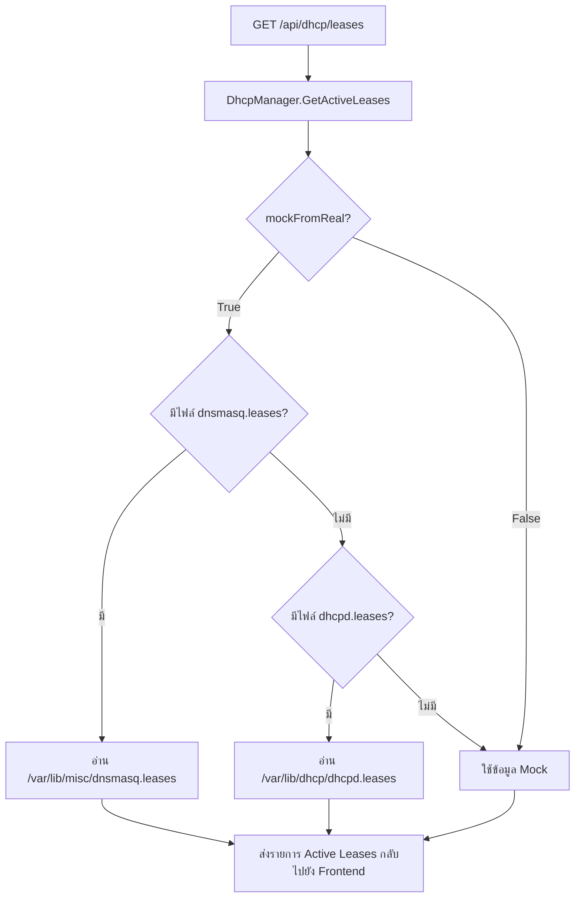

# DHCP Server — บันทึกการทำงานของระบบ

เอกสารนี้อธิบายกระบวนการทำงานของระบบ **DHCP Server** (ระบบจ่ายไอพีแอดเดรสอัตโนมัติ) ใน PiGate ตั้งแต่ข้อมูลการเก็บโครงสร้างตั้งค่า การจอง IP (Static Reservations) และการซิงค์ข้อมูลผู้ใช้งานที่เชื่อมต่อ (Active Leases) จากไฟล์ประวัติของระบบปฏิบัติการ Linux จริง

---

## 1. Data Models

ไฟล์: `backend/internal/model/types.go`

### 1.1 `DhcpConfig` (การตั้งค่าหลัก)
```go
type DhcpConfig struct {
    Enabled   bool   `json:"enabled"`   // สถานะเปิด/ปิดบริการ DHCP
    Interface string `json:"interface"` // การ์ดแลนที่เปิดจ่ายไอพี (เช่น "eth0")
    StartIP   string `json:"startIp"`   // IP เริ่มต้นของช่วงจ่าย (เช่น "192.168.1.100")
    EndIP     string `json:"endIp"`     // IP สิ้นสุดของช่วงจ่าย (เช่น "192.168.1.200")
    Gateway   string `json:"gateway"`   // Gateway ที่จะส่งให้ client (เช่น "192.168.1.1")
    Netmask   string `json:"netmask"`   // Subnet mask (เช่น "255.255.255.0")
    DNS1      string `json:"dns1"`      // DNS หลัก (เช่น "8.8.8.8")
    DNS2      string `json:"dns2"`      // DNS สำรอง (เช่น "1.1.1.1")
    LeaseTime int    `json:"leaseTime"` // ระยะเวลาการจองใช้งานในหน่วยวินาที (เช่น 86400 = 1 วัน)
}
```

### 1.2 `DhcpReservation` (การจองไอพีตาม MAC Address)
```go
type DhcpReservation struct {
    ID         string `json:"id"`
    DeviceName string `json:"deviceName"` // ชื่ออุปกรณ์
    MacAddress string `json:"macAddress"` // MAC Address อุปกรณ์
    IPAddress  string `json:"ipAddress"`  // IP ที่ต้องการจองให้เฉพาะตัว
}
```

### 1.3 `ActiveDhcpLease` (ข้อมูลผู้เชื่อมต่อในปัจจุบัน)
```go
type ActiveDhcpLease struct {
    ID         string `json:"id"`
    IPAddress  string `json:"ipAddress"`  // IP ที่ได้รับการจัดสรรจริง
    MacAddress string `json:"macAddress"`  // MAC Address ของอุปกรณ์ที่เชื่อมต่อ
    Hostname   string `json:"hostname"`   // ชื่อโฮสต์ของอุปกรณ์
    ExpiresIn  string `json:"expiresIn"`  // ระยะเวลาที่เหลือก่อนสัญญาเช่าจะหมดอายุ
}
```

---

## 2. Database Schema

ไฟล์: `backend/internal/db/connection.go`

```sql
-- 1. ตารางตั้งค่าหลัก (จำกัดให้มี row ID = 1 เท่านั้น)
CREATE TABLE IF NOT EXISTS dhcp_config (
    id         INTEGER PRIMARY KEY CHECK(id = 1),
    enabled    INTEGER DEFAULT 1 CHECK(enabled IN (0, 1)),
    interface  TEXT NOT NULL,
    start_ip   TEXT NOT NULL,
    end_ip     TEXT NOT NULL,
    gateway    TEXT NOT NULL,
    netmask    TEXT NOT NULL,
    dns1       TEXT NOT NULL,
    dns2       TEXT NOT NULL,
    lease_time INTEGER NOT NULL
);

-- 2. ตารางเก็บข้อมูลการจองไอพี
CREATE TABLE IF NOT EXISTS dhcp_reservations (
    id          TEXT PRIMARY KEY,
    device_name TEXT NOT NULL,
    mac_address TEXT UNIQUE NOT NULL,
    ip_address  TEXT NOT NULL
);
```

---

## 3. การดึงข้อมูลผู้เชื่อมต่อเรียลไทม์ (Active Leases Sync Flow)

ไฟล์: `backend/internal/kernel/mock.go` — ฟังก์ชัน `GetActiveLeases()`

ในสภาพแวดล้อมระบบปฏิบัติการ Linux จริง (เมื่อ `mockFromReal = true` หรือรันบน Production) ระบบหลังบ้านจะดึงข้อมูลการเชื่อมต่อจริงจากไฟล์ระบบของ DHCP Daemon (เช่น `dnsmasq` หรือ `isc-dhcp-server`):



### ฟังก์ชันวิเคราะห์ประวัติสัญญาเช่า (Lease Parsers):
* **`parseDnsmasqLeases(filePath)`**
  * รูปแบบบรรทัดในไฟล์: `<timestamp> <mac_address> <ip_address> <hostname> <client_id>`
  * ระบบจะดึงฟิลด์ที่ 1 (MAC), 2 (IP) และ 3 (Hostname) มาจัดโครงสร้าง `ActiveDhcpLease` โดยอัตโนมัติ
* **`parseDhcpdLeases(filePath)`**
  * รูปแบบในไฟล์มีปีกกาครอบเป็นบล็อก `lease <ip> { ... }`
  * ระบบสแกนหาข้อความ `hardware ethernet <mac>;` และ `client-hostname "<hostname>";` ในแต่ละบล็อกมาสร้างข้อมูลการเชื่อมต่อ

---

## 4. REST API Endpoints

| Method | Path | Handler | หน้าที่ |
|---|---|---|---|
| `GET` | `/api/dhcp/config` | `HandleGetDHCPConfig` | ดึงข้อมูลการตั้งค่าหลักของ DHCP Server |
| `PUT` | `/api/dhcp/config` | `HandleUpdateDHCPConfig` | อัปเดตข้อมูลการตั้งค่าหลักลงฐานข้อมูล SQLite |
| `GET` | `/api/dhcp/reservations` | `HandleGetDHCPReservations` | ดึงรายการจองไอพีทั้งหมด |
| `POST` | `/api/dhcp/reservations` | `HandleCreateDHCPReservation` | เพิ่มการจองไอพีใหม่ให้กับอุปกรณ์ (สแกนหา MAC ซ้ำอัตโนมัติ) |
| `PUT` | `/api/dhcp/reservations/{id}` | `HandleUpdateDHCPReservation` | แก้ไขข้อมูลการจองไอพีของอุปกรณ์ |
| `DELETE` | `/api/dhcp/reservations/{id}` | `HandleDeleteDHCPReservation` | ยกเลิกการจองไอพีของอุปกรณ์ |
| `GET` | `/api/dhcp/leases` | `HandleGetDHCPLeases` | ดึงประวัติการเช่าจ่ายไอพีแบบ Active ณ ขณะนั้น |
| `POST` | `/api/dhcp/apply` | `HandleApplyDHCP` | เขียนไฟล์ config และ restart บริการจ่ายไอพีในเคอร์เนล |

---

## 5. Mock Mode

| โหมด | พฤติกรรม |
|---|---|
| `mockMode = true` | บันทึกค่าการจองไอพีลง SQLite ปกติ แต่เมื่อเรียก `ApplyConfig()` จะเพียงพิมพ์ log จำลองลง Console และเมื่อขอรายการ active leases จะส่งข้อมูล mock กลับไป (iPhone-13, iPad-Pro, TV) |
| `mockMode = false` (Production) | นำค่า config และ reservations ทั้งหมดไปเขียนทับลงไฟล์ `/etc/dhcp/dhcpd.conf` หรือ `/etc/dnsmasq.conf` จากนั้นสั่ง restart service ผ่าน systemd wrapper |

---

## 6. ข้อควรระวัง

1. **ไอพีของพอร์ตที่เปิดใช้งาน (Interface IP Requirement)** — ในการเปิดใช้ DHCP บนอินเตอร์เฟสใดๆ (เช่น `eth0`) อินเตอร์เฟสขานั้นจะต้องได้รับการตั้งค่าแบบ **Static IP** ในระบบก่อนเสมอ เพื่อให้มีไอพีหลักสำหรับรับส่งแพ็กเก็ต DHCP
2. **การตั้งช่วงไอพีจ่าย (IP Pool Range)** — ช่วง `startIp` และ `endIp` จะต้องอยู่ภายใน Subnet วงเดียวกันกับไอพีประจำตัวของการ์ดเครือข่ายนั้น
3. **การป้องกัน IP ชนกัน (MAC Address Uniqueness)** — ตาราง `dhcp_reservations` มีการกำหนดสิทธิ์ `UNIQUE` สำหรับฟิลด์ `mac_address` เพื่อป้องกันไม่ให้อุปกรณ์สองตัวจองทับสิทธิ์กัน

---

## 7. Kernel Integration (Production)

ในโหมดการทำงานจริง บน Raspberry Pi 5 ระบบจะเชื่อมต่อกับบริการจัดสรรไอพีผ่านการสั่งการ systemd service:

### ลำดับคำสั่งที่ทำในระดับ OS:
1. หลังบ้านนำข้อมูลจากฐานข้อมูลมาเขียนฟอร์แมต `/etc/dhcp/dhcpd.conf` (หรือ dnsmasq config)
2. นำข้อมูลจากตาราง `dhcp_reservations` เขียนลงบล็อก host configuration:
   ```conf
   host device_iphone {
       hardware ethernet 99:88:77:66:55:44;
       fixed-address 192.168.1.101;
   }
   ```
3. สั่ง Restart บริการหลังบ้านผ่าน Command line หรือ Systemd DBus API:
   ```bash
   sudo systemctl restart isc-dhcp-server.service
   ```

---

## 8. ไฟล์ที่เกี่ยวข้อง

| ไฟล์ | หน้าที่ |
|---|---|
| [`backend/internal/model/types.go`](../../../backend/internal/model/types.go) | โครงสร้าง structs ของ `DhcpConfig`, `DhcpReservation` และ `ActiveDhcpLease` |
| [`backend/internal/db/connection.go`](../../../backend/internal/db/connection.go) | DB Schema ของตาราง `dhcp_config` และ `dhcp_reservations` |
| [`backend/internal/db/repository.go`](../../../backend/internal/db/repository.go) | ฟังก์ชัน CRUD สำหรับการจองไอพีและการดึงตั้งค่าหลักของ DHCP |
| [`backend/internal/api/handlers.go`](../../../backend/internal/api/handlers.go) | HTTP handlers สำหรับ endpoints ของ DHCP ทั้งหมด |
| [`backend/internal/kernel/interfaces.go`](../../../backend/internal/kernel/interfaces.go) | `DhcpManager` interface ที่ใช้กำหนดเมธอด `ApplyConfig` และ `GetActiveLeases` |
| [`backend/internal/kernel/mock.go`](../../../backend/internal/kernel/mock.go) | ตัวซิงค์ข้อมูล leases จากไฟล์ของ OS จริง หรือ Mock data ในตัว |
