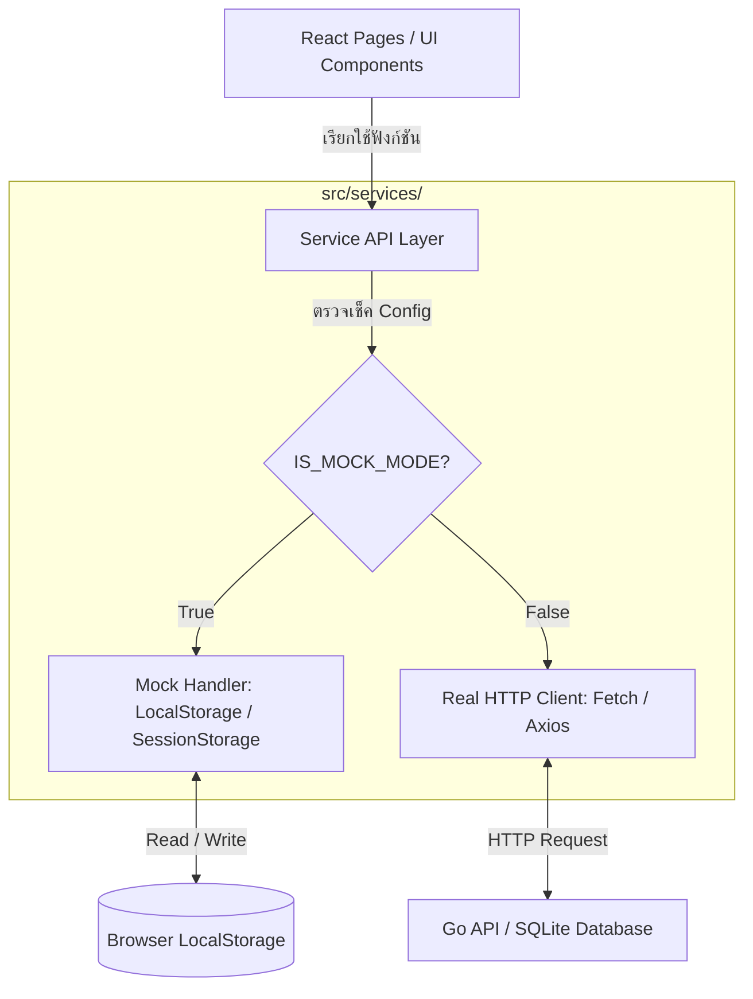

# คู่มือการทดสอบข้อมูลและสถาปัตยกรรม Service API Layer (PiGate)

เอกสารฉบับนี้อธิบายถึงแนวทางและมาตรฐานการพัฒนา **Service API Layer** ของโปรเจกต์ **PiGate** เพื่อรองรับการทำสอบข้อมูลฝั่งหน้าบ้าน (Frontend Data Testing) ด้วย **LocalStorage** ในเฟสปัจจุบัน และการสลับไปใช้งาน **Go Backend API** จริงในอนาคต โดยไม่ต้องแก้ไขโค้ดฝั่งหน้าจอ (UI Component Pages)

---

## 1. แนวคิดและสถาปัตยกรรม (Architectural Concept)

เพื่อแยกหน้าที่ (Separation of Concerns) และอำนวยความสะดวกในการทดสอบระบบ เราจึงออกแบบระบบติดต่อสื่อสารข้อมูลผ่านสถาปัตยกรรมดังนี้:



### ข้อดีของระบบนี้:
1. **UI Cleanliness:** หน้าจอต่างๆ (เช่น `Addresses.tsx`, `Dashboard.tsx`) ไม่จำเป็นต้องทราบว่าข้อมูลเดินทางมาจากไหน (LocalStorage หรือ Web API) โค้ดของหน้าจอจะเรียกใช้ฟังก์ชันอย่างง่าย เช่น `addressService.getAll()`
2. **Zero-Code Change UI:** เมื่อ Go Backend API พร้อมใช้งาน ทีมพัฒนาสามารถสลับสวิตช์เพียงจุดเดียวที่ไฟล์ Config ข้อมูลในระบบจะเปลี่ยนจากโหมดจำลองเป็นโหมดหลังบ้านจริงทันที
3. **Simulated Delays & Errors:** สามารถจำลอง Network Latency (ความหน่วงเน็ต) เพื่อดูความลื่นไหลของสถานะ Loading และสามารถจำลองกรณีเกิด Error 500/400 เพื่อทดสอบการแจ้งเตือนภัยบนหน้าเว็บได้

---

## 2. โครงสร้างไฟล์ในระบบ (File Structure)

เมื่อเริ่มพัฒนาระบบนี้ ให้สร้างไฟล์และโฟลเดอร์เพิ่มที่ `src/services/` ดังนี้:

```text
frontend/src/
├── data-mockup/
│   └── mockData.ts        # ข้อมูลสำหรับเริ่มต้น (Seed Data / Types)
└── services/
    ├── config.ts          # ไฟล์ตั้งค่าและสวิตช์เปิด/ปิดโหมดจำลอง
    ├── addressService.ts  # จัดการ CRUD สำหรับวัตถุที่อยู่ไอพี (Addresses)
    ├── policyService.ts   # จัดการ CRUD สำหรับกฎไฟร์วอลล์ (Firewall Policies)
    ├── serviceObjectService.ts  # จัดการ CRUD สำหรับวัตถุบริการพอร์ต (Services)
    └── interfaceService.ts      # จัดการสถานะ Network Interfaces และแสกน Wi-Fi
```

---

## 3. ตัวอย่างการใช้งานโค้ดอ้างอิง (Code Blueprint)

### 3.1 การตั้งค่าระบบสวิตช์ (`src/services/config.ts`)
ใช้สำหรับกำหนดว่าระบบในเครื่องนักพัฒนาจะใช้ข้อมูลจำลองหรือข้อมูลจริง โดยสามารถสลับผ่านการระบุใน `localStorage` หรือตรวจเช็คจาก Environment Variable:

```typescript
// ตรวจสอบโหมดจำลอง (Mock Mode)
// 1. อ่านค่าจาก Environment Variable VITE_USE_MOCK
// 2. หรือตรวจเช็คว่าใน LocalStorage มีคีย์ PIGATE_DEV_MODE = 'mock' หรือไม่
export const IS_MOCK_MODE = 
  import.meta.env.VITE_USE_MOCK === "true" || 
  localStorage.getItem("PIGATE_DEV_MODE") === "mock" ||
  true; // กำหนดค่าเริ่มต้นเป็น true ในระยะแรกเพื่อทดสอบ

// กำหนด URL สำหรับเชื่อมต่อ Go Backend จริง
export const API_BASE_URL = import.meta.env.VITE_API_BASE_URL || "/api";
```

> [!TIP]
> **การเปิดโหมดดักจับ (Dev Mode Switcher):**
> นักพัฒนาสามารถเปิด Console ของเบราว์เซอร์แล้วพิมพ์:
> `localStorage.setItem("PIGATE_DEV_MODE", "mock")` เพื่อสลับไปโหมดจำลอง หรือ
> `localStorage.removeItem("PIGATE_DEV_MODE")` เพื่อสลับกลับไปโหมดเชื่อมหลังบ้านจริง จากนั้นกด Refresh หน้าจอ

---

### 3.2 ตัวอย่างไฟล์ Service (`src/services/addressService.ts`)
ตัวอย่างการจัดการข้อมูลที่มีการสลับเส้นทางเก็บข้อมูลใน LocalStorage:

```typescript
import { type AddressObject, initialAddressObjects } from "@/data-mockup/mockData";
import { IS_MOCK_MODE, API_BASE_URL } from "./config";

const STORAGE_KEY = "pigate_addresses";

// โหลดข้อมูลจาก LocalStorage (และใส่ข้อมูลตั้งต้นหากไม่พบ)
function getMockData(): AddressObject[] {
  const stored = localStorage.getItem(STORAGE_KEY);
  if (!stored) {
    localStorage.setItem(STORAGE_KEY, JSON.stringify(initialAddressObjects));
    return initialAddressObjects;
  }
  return JSON.parse(stored);
}

// บันทึกข้อมูลลง LocalStorage
function saveMockData(data: AddressObject[]) {
  localStorage.setItem(STORAGE_KEY, JSON.stringify(data));
}

export const addressService = {
  // ดึงข้อมูลทั้งหมด
  getAll: async (): Promise<AddressObject[]> => {
    if (IS_MOCK_MODE) {
      // จำลองหน่วงเวลา 250ms เพื่อให้ UI ได้แสดงสถานะ Loading
      await new Promise((resolve) => setTimeout(resolve, 250));
      return getMockData();
    }

    const response = await fetch(`${API_BASE_URL}/addresses`);
    if (!response.ok) throw new Error("Failed to fetch address objects");
    return response.json();
  },

  // บันทึกหรือสร้างข้อมูลใหม่
  save: async (obj: AddressObject): Promise<AddressObject> => {
    if (IS_MOCK_MODE) {
      await new Promise((resolve) => setTimeout(resolve, 300));
      const currentData = getMockData();
      const exists = currentData.some((item) => item.id === obj.id);
      
      let updated: AddressObject[];
      if (exists) {
        // แก้ไข
        updated = currentData.map((item) => (item.id === obj.id ? obj : item));
      } else {
        // สร้างใหม่
        updated = [...currentData, obj];
      }
      
      saveMockData(updated);
      return obj;
    }

    // เมื่อเชื่อมต่อจริงใช้ POST หรือ PUT ตามไอดีวัตถุ
    const isNew = !obj.id.startsWith("addr-") || obj.id.length < 5; // กำหนดตามระบบไอดี
    const method = isNew ? "POST" : "PUT";
    const url = isNew ? `${API_BASE_URL}/addresses` : `${API_BASE_URL}/addresses/${obj.id}`;

    const response = await fetch(url, {
      method: method,
      headers: { "Content-Type": "application/json" },
      body: JSON.stringify(obj),
    });
    if (!response.ok) throw new Error("Failed to save address object");
    return response.json();
  },

  // ลบข้อมูลวัตถุ
  delete: async (id: string): Promise<boolean> => {
    if (IS_MOCK_MODE) {
      await new Promise((resolve) => setTimeout(resolve, 200));
      const currentData = getMockData();
      const filtered = currentData.filter((item) => item.id !== id);
      saveMockData(filtered);
      return true;
    }

    const response = await fetch(`${API_BASE_URL}/addresses/${id}`, {
      method: "DELETE",
    });
    return response.ok;
  }
};
```

---

### 3.3 วิธีการเรียกใช้งานที่หน้าจอ (React Page Integration)

ตัวอย่างการเรียกใช้ฟังก์ชันในหน้า [Addresses.tsx](file:///home/sapray/dev/pigate/frontend/src/pages/Addresses.tsx):

```tsx
import { useEffect, useState } from "react";
import { addressService } from "@/services/addressService";
import { type AddressObject } from "@/data-mockup/mockData";
import { Loader2 } from "lucide-react"; // ใช้แสดงสปินเนอร์ตอนรอข้อมูล

export default function Addresses() {
  const [addresses, setAddresses] = useState<AddressObject[]>([]);
  const [isLoading, setIsLoading] = useState(true);
  const [error, setError] = useState("");

  // 1. ดึงข้อมูลครั้งแรกเมื่อโหลดคอมโพเนนต์
  useEffect(() => {
    loadData();
  }, []);

  const loadData = async () => {
    setIsLoading(true);
    setError("");
    try {
      const data = await addressService.getAll();
      setAddresses(data);
    } catch (err: any) {
      setError(err.message || "เกิดข้อผิดพลาดในการโหลดข้อมูล");
    } finally {
      setIsLoading(false);
    }
  };

  // 2. เรียกใช้งานตอนบันทึกข้อมูล (Save)
  const handleSave = async (formObject: AddressObject) => {
    try {
      await addressService.save(formObject);
      loadData(); // โหลดข้อมูลสดใหม่มาทับ
      setIsModalOpen(false);
    } catch (err: any) {
      alert("ไม่สามารถบันทึกข้อมูลได้: " + err.message);
    }
  };

  // 3. เรียกใช้งานตอนลบข้อมูล (Delete)
  const handleDelete = async (id: string) => {
    if (!confirm("ยืนยันการลบวัตถุนี้?")) return;
    try {
      await addressService.delete(id);
      loadData();
    } catch (err: any) {
      alert("ไม่สามารถลบข้อมูลได้: " + err.message);
    }
  };

  if (isLoading) {
    return (
      <div className="flex items-center justify-center min-h-[400px]">
        <Loader2 className="h-8 w-8 animate-spin text-primary" />
        <span className="ml-2 text-sm text-muted-foreground">กำลังโหลดข้อมูล...</span>
      </div>
    );
  }

  // แสดงผลตารางปกติหลังจากโหลดเสร็จ...
}
```

---

## 4. ข้อควรระวังในการพัฒนา (Best Practices & Gotchas)

1. **การรักษาโครงสร้าง Type ข้อมูล (Type Uniformity):** 
   โมเดลโครงสร้างข้อมูล (TypeScript Interfaces) ที่ประกาศใน [mockData.ts](file:///home/sapray/dev/pigate/frontend/src/data-mockup/mockData.ts) ต้องมีโครงสร้างตรงกันกับที่ฝั่ง Go Backend ส่งค่ากลับมา (เช่น การใช้ฟิลด์ตัวพิมพ์เล็ก/ใหญ่ หรือรูปแบบ Array) เพื่อไม่ให้สลับโหมดแล้วโค้ดระเบิด
2. **การทำ Data Seeding บน LocalStorage:** 
   เมื่อเบราว์เซอร์ไม่มีข้อมูลใน LocalStorage ฟังก์ชันจำลองควรดึงข้อมูลจาก `initialMockData` มาบันทึกเป็นค่าตั้งต้นไว้ในครั้งแรก เพื่อไม่ให้ผู้ใช้งานเข้ามาเจอตารางว่างเปล่า
3. **การทดสอบความปลอดภัยและการกรอกข้อมูล (Validation):**
   การกรอกข้อมูลยังคงต้องมีระบบ Validate ที่ฝั่ง Frontend เหมือนเดิม เพื่อให้โหมดจำลองจำกัดรูปแบบข้อมูลที่เป็นไปได้ก่อนนำไปบันทึก
