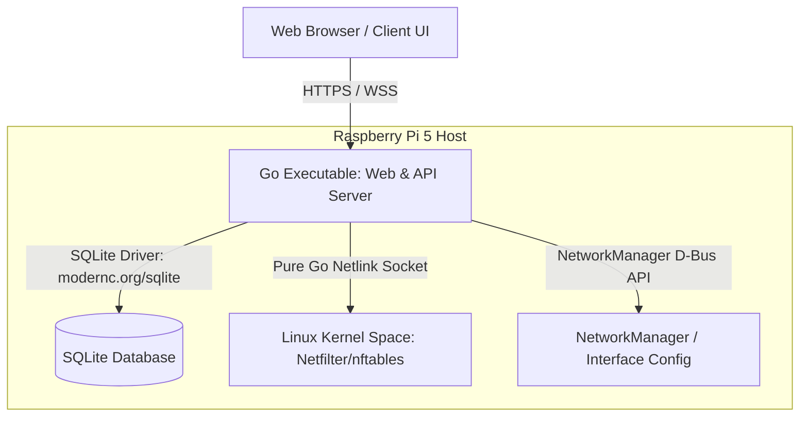

# PiGate Tech Stack Design & Blueprint

เอกสารฉบับนี้เป็นคู่มือการออกแบบและข้อกำหนดทางเทคนิค (Tech Stack Blueprint) สำหรับการพัฒนาระบบ **PiGate** (Raspberry Pi Firewall/Gateway Controller) โดยมุ่งเน้นไปที่การใช้สถาปัตยกรรมประสิทธิภาพสูง (High-Performance Architecture), ความปลอดภัยระดับแกนหลัก (Kernel-level Security), และลดความเสี่ยงจากการถูกโจมตีด้วยห่วงโซ่อุปทาน (Supply Chain Attack)

---

## 1. System Architecture Overview

สถาปัตยกรรมของ PiGate จะแบ่งออกเป็น 3 Layer หลัก โดยมี **Go (Golang)** ทำหน้าที่เป็นทั้ง API Backend และเซิร์ฟเวอร์เสิร์ฟหน้าเว็บในไฟล์เดี่ยว (Single Binary):



---

## 2. Frontend Technology Stack

เพื่อลดภาระประมวลผลบนตัวบอร์ด Raspberry Pi ให้เหลือน้อยที่สุด หน้าบ้านจะถูกออกแบบให้เป็น **Single Page Application (SPA)** เพื่อประมวลผลที่เครื่องผู้ใช้งาน (Client-side Rendering):

* **Core Framework**: **React (Vite)**
  * *เหตุผล*: จัดการ UI State ซับซ้อนได้รวดเร็ว มีระบบ Lifecycle ที่นิ่ง และทำงานสอดประสานกับไลบรารี Drag & Drop ล่าสุดได้เต็มประสิทธิภาพ
* **CSS Framework**: **Tailwind CSS**
  * *เหตุผล*: ช่วยกำหนด Style ด้วย Utility-first CSS ทำให้เว็บเบา ปรับแต่ง Theme (Dark/Light mode) และสร้างความสวยงามระดับพรีเมียมได้ง่าย
* **Component Library**: **shadcn/ui** (Radix UI Primitives)
  * *เหตุผล*: ต่างจาก UI library ทั่วไป เพราะ shadcn/ui เป็นการ Copy-paste โค้ดคอมโพเนนต์ลงในโปรเจกต์โดยตรง ทำให้เราควบคุมและแก้ไขสไตล์ระดับล่าง (Fine-grain customization) ได้เอง ไม่มีปัญหา Package Bloat หรือส่งผลกระทบต่อขนาด Bundle และมี Accessibility (a11y) สูงมากจากตัว Radix UI
* **UI Controls & Components**:
  * **@dnd-kit/core** & **@dnd-kit/sortable**: เครื่องมือสำหรับทำ Drag & Drop จัดเรียงกฎความสำคัญของนโยบายไฟร์วอลล์ในหน้า [02-firewall-policies.html](file:///home/sapray/Dev/pigate/docs/sketchs/frontend/02-firewall-policies.html)
    * *เหตุผล*: เป็นระบบ Drag & Drop ยุคใหม่ที่ออกแบบมาสำหรับ React โดยเฉพาะ มีขนาดเล็ก รองรับ Touch/Mouse Sensor เต็มรูปแบบ และลื่นไหลกว่าระบบเดิม
  * **Recharts**: ไลบรารีวาดกราฟสถิติ Real-time Traffic ในหน้า [01-dashboard.html](file:///home/sapray/Dev/pigate/docs/sketchs/frontend/01-dashboard.html)
  * **Lucide React**: ชุดไอคอนมินิมอลรองรับ SVG
* **Deployment Pattern**:
  * เมื่อบิวด์โปรเจกต์เสร็จสิ้น (รัน `npm run build` หรือ `yarn build` ด้วย Yarn) ไฟล์ HTML, CSS, JS จะถูกนำมาฝังลงในตัวแอปพลิเคชันหลังบ้านผ่านฟีเจอร์ **`go:embed`** ของภาษา Go


---

## 3. Backend Technology Stack (Go/Golang)

หลังบ้านพัฒนาด้วยภาษา **Go (Golang)** เพื่อความเร็ว ความเสถียรสูงสุด และป้องกันปัญหา Supply Chain Attack:

* **API Server Engine**: **Go Standard Library (`net/http`)** หรือ **Fiber/Gin**
  * *เหตุผล*: หากใช้ Standard library เป็นหลัก จะช่วยลดไลบรารีภายนอกให้เหลือเกือบ 0% ช่วยปิดโอกาสการเกิด Supply Chain Attack ได้อย่างสมบูรณ์
* **Input Validation**: พัฒนา Custom validation และจำกัดรูปแบบข้อมูลอินพุตด้วย Regular Expressions เพื่อป้องกันการโจมตีทางเว็บเบื้องต้น
* **Database Driver**: **`modernc.org/sqlite`**
  * *เหตุผล*: เป็นตัวเชื่อมต่อ SQLite ที่เขียนด้วย Pure Go (ไม่มี CGO Dependency) ทำให้คอมไพล์โค้ดได้ง่ายและไม่ต้องมี C Compiler ติดตั้งบนคอมพิวเตอร์ที่ใช้พัฒนา

---

## 4. Kernel Integration & Privilege Separation (ความปลอดภัยระดับ OS)

ระบบ Gateway จำเป็นต้องเปลี่ยนการตั้งค่านโยบาย Firewall และสิทธิ์ของพอร์ตเชื่อมต่อ ซึ่งตามปกติจำเป็นต้องใช้สิทธิ์สูงสุด (Root) เพื่อความปลอดภัยสูงสุด ระบบจึงออกแบบแนวทางการจัดการสิทธิ์ดังนี้:

### 4.1 Direct Socket Interaction (หลีกเลี่ยง Shell Commands)
การเรียกใช้คำสั่งผ่านเชลล์มีความเสี่ยงต่อช่องโหว่ Command Injection หากกรองค่าอินพุตไม่รัดกุม ระบบ PiGate ในส่วน Go Backend จึงสื่อสารกับเคอร์เนลผ่าน **Netlink Socket** โดยตรง:
* **Firewall (nftables)**: ใช้ไลบรารี [google/nftables](https://github.com/google/nftables) (Pure Go) ในการอ่าน เขียน และแก้ไขนโยบายของ Netfilter โดยตรงผ่านระดับ Netlink Socket
* **Network & Routing**: ใช้ [vishvananda/netlink](https://github.com/vishvananda/netlink) ในการจัดการสถานะอินเทอร์เฟซ, เพิ่ม/ลบไอพีแอดเดรส และการกำหนดตารางเส้นทาง (Routing Table)
* **OS Services**: เชื่อมต่อผ่าน D-Bus API หรือเขียนสตรีมไฟล์คอนฟิกตรง เช่น `/etc/wpa_supplicant.conf`

### 4.2 Linux Capabilities (ลดขอบเขตการยึดครองระบบ)
ตัวแอปพลิเคชัน Go จะไม่ถูกรันด้วยสิทธิ์ผู้ใช้ `root` โดยตรง แต่จะถูกกำหนดเป็นสิทธิ์ผู้ใช้ธรรมดา (เช่น `pigate`) และนำคุณสมบัติ **Linux Capabilities** ไปผูกไว้ที่ตัวไฟล์ Executable เพื่อให้รันงานที่เกี่ยวข้องกับเครือข่ายได้เท่านั้น:
```bash
sudo setcap cap_net_admin,cap_net_raw+ep ./pigate-backend
```
* **`cap_net_admin`**: สิทธิ์ในการตั้งค่า Network Interface, IP, Routes และ Firewall Tables (`nftables`)
* **`cap_net_raw`**: สิทธิ์ในการสร้าง Raw Sockets (จำเป็นสำหรับการรันคำสั่ง Ping หรือจับแพ็กเก็ต)
* *ข้อดี*: หากแอปพลิเคชันหน้าเว็บมีช่องโหว่ RCE แฮกเกอร์ก็จะไม่สามารถเข้ามาเขียนทับไฟล์ระบบ หรือลบไฟล์ส่วนอื่นๆ ใน OS ได้เนื่องจากรันภายใต้สิทธิ์ผู้ใช้จำกัดทั่วไป

---

## 5. Security & Protection Against Supply Chain Attack

ระบบ Go ได้กำหนดแนวทางความปลอดภัยของโค้ดต้นทางและการนำไปใช้ไว้ดังนี้:

1. **Strict Dependency Pinning & Verification**:
   * การใช้ `go.sum` เพื่อเก็บ Cryptographic Hash สำหรับรับประกันว่าไม่มีโมดูลตัวใดถูกแก้ไขโค้ดระหว่างทาง
   * การประเมินและคัดกรอง Dependency ภายนอก โดยเลือกใช้เฉพาะระดับ Core SDK หรือคลังเก็บสถิติที่มีผู้ดูแลเป็นทางการ (เช่น `golang.org/x/...` หรือ `github.com/google/...`)
2. **Static Linking**:
   * การคอมไพล์โค้ดออกเป็นไฟล์ Executable ไฟล์เดียว ช่วยลดความซับซ้อนในการติดตั้งโมดูลย่อยบนระบบลินุกซ์ และทำให้มั่นใจได้ว่าโค้ดที่รันอยู่เบื้องหลังเป็นเวอร์ชันเดียวกันกับที่ผ่านการตรวจสอบ
3. **No Dynamic Code Evaluation**:
   * ภาษา Go ไม่มีคำสั่งประเมินผลโค้ดขณะรัน (เช่น `eval()` ใน JS/Python) ทำให้ปิดช่องโหว่การโจมตีประเภท Dynamic Code Injection ได้โดยปริยาย

---

## 6. Authentication, Session & Access Control

ระบบความปลอดภัยในการเข้าถึง API สำหรับผู้ดูแลระบบ:
* **Authentication**: ระบบจะยืนยันตัวตนผ่านสคีมาล็อกอินที่เข้ารหัสรหัสผ่านด้วยอัลกอริทึม **Argon2id** หรือ **bcrypt**
* **Session Management**: ใช้ **JWT (JSON Web Token)** หรือ **Session ID** ที่จัดเก็บไว้ในฝั่ง Client ผ่าน **HttpOnly, Secure, SameSite=Strict Cookies** เท่านั้น
  * *เหตุผล*: ป้องกันการโจมตีประเภท Cross-Site Scripting (XSS) ไม่ให้เข้าถึงโทเค็นเพื่อนำไปทำ Session Hijacking ได้
* **Rate Limiting**: เพิ่มระบบทำ Rate Limiter (เช่น อัลกอริทึม Token Bucket) บน API ล็อกอิน เพื่อป้องกันการถูกเดารหัสผ่านแบบสุ่ม (Brute-Force Attacks)

---

## 7. Real-Time Data Streaming (Server-Sent Events)

สำหรับการอัปเดตสถิติ Real-time Performance และทราฟฟิก WAN ในหน้า Dashboard:
* **Technology**: **Server-Sent Events (SSE)**
  * *เหตุผล*: SSE เป็นโปรโตคอลการส่งข้อมูลแบบทิศทางเดียว (Server-to-Client) ที่รันผ่าน HTTP โปรโตคอลมาตรฐาน ทำให้เขียนโค้ดฝั่ง Go Backend ได้ง่ายโดยใช้เพียง `http.ResponseWriter` มาตรฐานโดยไม่ต้องลงไลบรารีเสริม และกินทรัพยากรระบบน้อยกว่าการใช้ WebSockets (ซึ่งต้องทำ Handshake และอัปเกรดโปรโตคอลแยกต่างหาก)

---

## 8. Logging & SD Card Preservation (ถนอมอายุการใช้งาน MicroSD Card)

บอร์ด Raspberry Pi มักใช้ MicroSD Card ในการเก็บระบบปฏิบัติการ ซึ่งมีจำนวนรอบการเขียน (Write Cycles) ที่จำกัด การบันทึกล็อกปริมาณมากอาจทำให้การ์ดชำรุดเสียหายเร็วขึ้น:
* **Log Storage**: หลีกเลี่ยงการเขียนสถิติล็อกของ Firewall (nftables Block Logs) ลงในฐานข้อมูล SQLite บนดิสก์อย่างต่อเนื่อง
* **Solution**:
  * บันทึกข้อมูลประวัติ Log ล่าสุดไว้ใน **In-Memory Circular Buffer (Ring Buffer)** บนแรมของ Go API
  * ใช้การอ่าน/ดึงข้อมูลสตรีมโดยตรงจาก **Systemd Journald** หรือเก็บไฟล์ล็อกไว้ใน `/run/` หรือ `/tmp/` (ซึ่งเป็น `tmpfs` หรือแรมเสมือนใน Linux) เพื่อลดภาระการเขียนข้อมูลลงหน่วยความจำถาวร

---

## 9. Network Configuration Mechanism (D-Bus Protocol)

การควบคุม LAN/Wi-Fi ใน Raspberry Pi OS รุ่นใหม่จะรันผ่านบริการ **NetworkManager**:
* **Mechanism**: แทนที่จะสั่งรันเชลล์ด้วยคำสั่ง `nmcli` หรือ `nmtui` ฝั่งหลังบ้าน Go จะส่งคำสั่งควบคุมการเปิด/ปิดพอร์ต, แสกน SSID หรือตั้งค่า IP Address ผ่าน **D-Bus IPC Socket** ดั้งเดิมของลินุกซ์ (เช่น ใช้โมดูล `godbus/dbus`)
  * *เหตุผล*: ได้ผลลัพธ์การทำงานที่แม่นยำกว่าการจับข้อความจาก stdout ของคอมมานด์ไลน์ ปลอดภัยจากการโจมตี และทำงานได้เร็วกว่า

